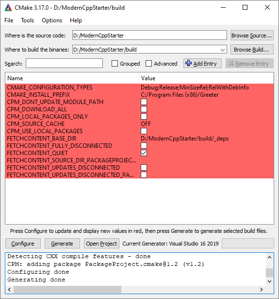
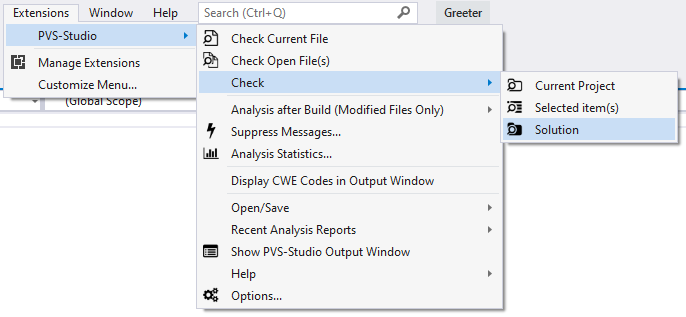
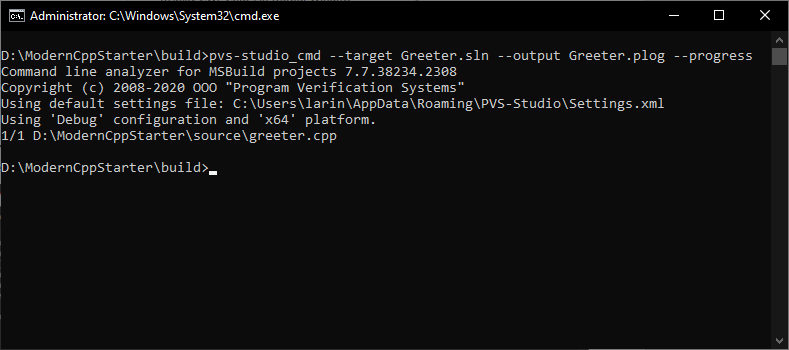

# PVS-Studio Static Code Analyzer

One of the ways to improve software quality is to check source code with static analysis tools. This section explains how to use the PVS-Studio analyzer to check projects built on ModernCppStarter. **We provide a free license for open-source projects.**

[PVS-Studio](https://www.viva64.com/en/pvs-studio/) is a tool for detecting bugs and security weaknesses in the source code of programs, written in C, C++, C# and Java. It works under 64-bit systems in Windows, Linux and macOS environments, and can analyze source code intended for 32-bit, 64-bit and embedded ARM platforms.

Using static analyzers is a good practice that helps detect a variety of defects in source code at the earlier development stages and thus make project development and maintenance cheaper. The analyzer carries out for you the routine job of scanning source code for typos and other types of defects that you normally have a hard time finding through code review ([examples](https://www.viva64.com/en/b/0260/), [examples](https://www.viva64.com/en/b/0509/), [examples](https://www.viva64.com/en/b/0713/)). With trivial bugs being automatically detected prior to code review, developers can focus more on the algorithms used and high-level bugs, which also adds to quality.

We provide a free license for open-source projects. Another way to use our analyzer for free is by adding special comments to source code, which is a perfect way to check small proprietary projects. To learn more about getting a free license, see the article "[Ways to Get a Free PVS-Studio License](https://www.viva64.com/en/b/0614/)".

What follows is a brief guide on running analysis with PVS-Studio.

## Windows

If you use Visual Studio, download and install the PVS-Studio plugin. Before starting a check, generate a Solution using the cmake-gui utility:



Once the solution has been generated, you can check the project using the PVS-Studio plugin. Just select Extensions -> PVS-Studio -> Check -> Solution:



To run automated checks, use the PVS-Studio_Cmd utility, which allows running analysis from the command line. Here is an example command for ModernCppStarter:

```bat
pvs-studio_cmd --target Greeter.sln --output Greeter.plog --progress
```



The --target argument specifies the solution file that you want checked; --output specifies the resulting report file, which you can then open in Visual Studio by double-clicking on it in Windows Explorer; --progress outputs the check progress.

To learn more about  how to use the plugin and how to analyze projects using the PVS-Studio_Cmd utility, see the article "[PVS-Studio for Visual Studio](https://www.viva64.com/en/b/0635/)".

In the ModernCppStarter repository, you can also find a file named pvs-studio.pvsconfig, which is an example configuration file for PVS-Studio's diagnostic rules. The configuration file is a plain text file added to a Visual Studio project. For more details, see the "Suppression of false positives through diagnostic configuration files (.pvsconfig)" subsection of the documentation section "[Suppression of false alarms](https://www.viva64.com/en/m/0017/)".

## Linux and macOS

To check your project, run CMake with a special flag enabled to generate compilation-start commands in the compile_commands.json file for the analyzer to use:

```sh
$ cmake -DCMAKE_EXPORT_COMPILE_COMMANDS=On <source_dir>
```

Build the project to make sure it compiles:

```sh
$ make
```

Now you can run the analyzer. The -l flag specifies the license file generated using the pvs-studio-analyzer credentials command – this flag is not necessary if the standard path was used. The -o flag specifies the resulting report file, and -j specifies the number of threads to be used by the analysis process. Note that the nproc command is not available on macOS – use sysctl -n hw.logicalcpu instead.

```sh
$ pvs-studio-analyzer -l <your_license_file> -o <log_file> -j$(nproc)
```

Once the check is finished, you can open the report file. It stores intermediate representation of the program, so we recommend using the plog-converter utility to view it:

```sh
$ plog-converter -t errorfile <log_file>
```

plog-converter will convert the report into the errorfile format (similar to GCC's messages), which can be conveniently viewed in a terminal window and the IDE. You can also have the report converted to an HTML file by using the -t fullhtml flag. Use the flags -a and -d to filter diagnostics. Run the plog-converter --help command to view the full list of available options.

## Configuring diagnostics

You may need to configure diagnostic rules for your project. See this page for details: [https://www.viva64.com/en/m/0040/](https://www.viva64.com/en/m/0040/)

To create a global configuration, you need to create a file named pvs_config.h with control comments in the project's root directory (or elsewhere) and then add the following code to the root CMakeLists.txt file:

```cmake
if(MSVC)
  add_compile_options(/FI "${CMAKE_CURRENT_SOURCE_DIR}/pvs_config.h")
else() # GCC/Clang
  add_compile_options(-include "${CMAKE_CURRENT_SOURCE_DIR}/pvs_config.h")
endif()
```

The purpose of this code is to include your configuration file in all of the source files. Make sure you specify the absolute path, or the analyzer won't be able to find the file when run from different directories.

If necessary, you can also use the PVS_STUDIO macro, which is set when running the analyzer, to exclude specific code fragments from analysis or override macros.

An example pvs_config.h file can be found in the ModernCppStarter repository.

When using PVS-Studio as a plugin for Visual Studio, you can also configure diagnostics using configuration files (.pvsconfig). This option was explained in the "Windows" section above.

## References

* PVS-Studio. [Download](https://www.viva64.com/en/pvs-studio-download/).
* PVS-Studio. [Documentation](https://www.viva64.com/en/m/).
* [Ways to Get a Free PVS-Studio License](https://www.viva64.com/en/b/0614/).
* PVS-Studio integration: [PlatformIO](https://www.viva64.com/en/b/0714/), [Chocolatey](https://www.viva64.com/en/b/0712/), [Azure DevOps](https://www.viva64.com/en/b/0670/), [CircleCI](https://www.viva64.com/en/b/0676/), [Travis CI](https://www.viva64.com/en/b/0636/), [GitLab CI/CD](https://www.viva64.com/en/b/0686/).
* [PVS-Studio as a SAST tool](https://www.viva64.com/en/sast/) (CWE, CERT, MISRA).

